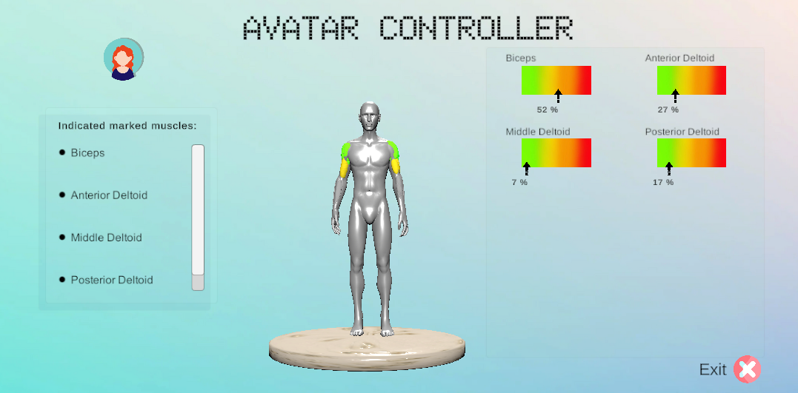
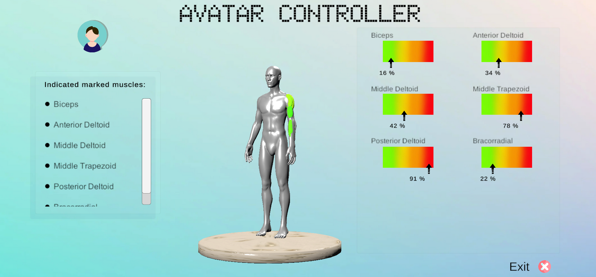

# Body Track VR – EMG Biofeedback in Virtual Reality

**Body Track VR** is an academic project developed to visualize electromyographic (EMG) activity in real-time through a virtual reality (VR) environment. It offers users interactive biofeedback using a customizable 3D human avatar and is designed for rehabilitation, education, and clinical applications.

## 🎯 Objectives

- Real-time biofeedback using EMG signals
- Custom avatar selection for better personalization
- Muscle group selection and highlighting
- Interactive VR visualization of muscle activity
- Simple and intuitive calibration interface

## 🧠 Features

- ✅ Muscle selection via toggles in UI
- ✅ Avatar choice (man, woman, boy, girl)
- ✅ MVC-based EMG calibration panel
- ✅ Real-time muscle coloring based on EMG data
- ✅ Avatar rotation and zoom for better visualization

## 🛠️ Technologies Used

- **Unity 3D** (2022.x)
- **TCP/IP Protocol**
- **MATLAB Scripts**  
- **C#** – Custom scripting   
- **NORAXON Ultium EMG system**  
- **Meta Quest-compatible VR SDK**

## 📚 Academic Context

This is the Final Degree Project (TFG) of **Esther Bermejo**, developed during the Biomedical Engineering degree at the **University of Alicante** (2021–2025).
🏅 Grade: 9.5 / 10

## 📄 Resources

- 🎓 **TFG Report (PDF):** [Link or embed once uploaded]  
- 🎥 **Defense Presentation:** [Presentation in Canva](https://www.canva.com/design/DAGs942APQg/jBIzGY0BiNMfOCBnd0tItw/watch?utm_content=DAGs942APQg&utm_campaign=designshare&utm_medium=link2&utm_source=uniquelinks&utlId=h15eaddfdf9)  
- 💻 **Code Repository:** You're here 😊

## 👥 Target Audience

- Rehabilitation professionals  
- Biomedical engineers  
- Students in EMG / biomechanics  
- Patients in neuromuscular rehab programs  

## 📸 Screenshots

### Muscle Selection UI  

### EMG Calibration Panel  

### Real-time Visualization  

---

## 📈 Future Work

- Automatic MVC detection  
- Support for more EMG hardware (OpenBCI, Myo, etc.)  
- Data logging and session export  
- Gamification for rehab adherence

## 📝 License

This project is for academic and non-commercial use. Contact the author for collaborations.

## 🙋‍♀️ Author

**Esther Bermejo**  
Biomedical Engineering (2021–2025)  
University of Alicante  
[LinkedIn](https://www.linkedin.com/in/esther-bermejo-mart%C3%ADnez-51a93929b/) | [estherbermejomartinez@gmail.com] | [Portfolio](https://github.com/Esther000-git/portfolio.git)

